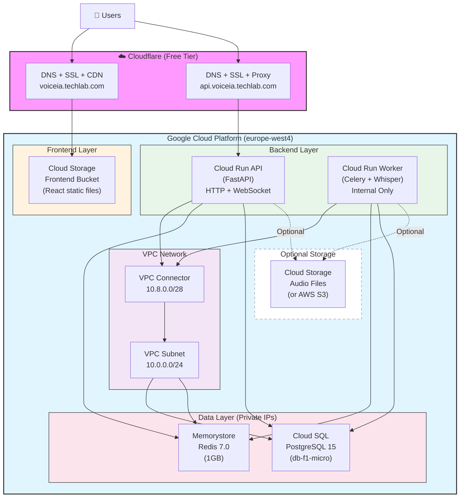

# Audio Text Infrastructure (GCP + Cloudflare)

Terraform configuration to deploy the Audio Text application infrastructure on Google Cloud Platform with Cloudflare for DNS, SSL, and CDN.

## Architecture Overview



### Architecture Benefits

**Simplified Design (No Load Balancer):**

- ❌ Removed: GCP Load Balancer, Cloud CDN, SSL Certificates, Cloud DNS
- ✅ Using: Cloudflare for DNS, SSL, CDN, and DDoS protection
- 💰 Cost savings: ~20% cheaper (~$80-125/month vs ~$100-150/month)

**Key Features:**

1. **Simpler**: Direct connections, fewer moving parts
2. **Faster**: Cloudflare's global CDN network
3. **Secure**: Private IPs, VPC networking, Cloudflare proxy protection
4. **Scalable**: Cloud Run auto-scales (0-10 instances for API, 1-5 for Worker)
5. **Managed**: No servers to maintain, automatic SSL renewal

## What's Provisioned

### Frontend

- **Cloud Storage Bucket**: Hosts React static files
- **Cloudflare CDN**: Caches and serves frontend globally

### Backend Services

- **Cloud Run API**: FastAPI service (HTTP + WebSocket support)
- **Cloud Run Worker**: Celery worker with Whisper ML model (internal only)

### Data Layer

- **Cloud SQL PostgreSQL 15**: Managed database (private IP)
- **Memorystore Redis 7.0**: Cache and message broker (private IP)
- **VPC Network**: Private network for secure communication
- **VPC Connector**: Allows Cloud Run to access private services

### Optional

- **Cloud Storage Bucket**: For audio files (if not using AWS S3)

## Prerequisites

- GCP account with billing enabled
- [Google Cloud SDK](https://cloud.google.com/sdk/docs/install) installed
- [Terraform](https://www.terraform.io/downloads.html) installed
- GCP service account with required permissions
- Cloudflare account with domain purchased
- Docker images built and pushed to GCR:
  - `gcr.io/PROJECT_ID/audio-api:latest`
  - `gcr.io/PROJECT_ID/audio-worker:latest`

## Quick Start

### 1. Setup GCP Credentials

Create a service account with required permissions and download the JSON key:

```bash
# Create credentials directory
mkdir -p credentials

# Place your service account JSON key at:
# credentials/gcp-key.json
```

**Required service account roles:**

- Cloud Run Admin
- Cloud SQL Admin
- Redis Admin
- Storage Admin
- Compute Network Admin
- Service Usage Admin

See `credentials/README.md` for detailed instructions.

### 2. Configure Variables

```bash
# Copy example configuration
cp terraform.tfvars.example terraform.tfvars

# Edit with your values
nano terraform.tfvars
```

**Required variables:**

```hcl
project_id         = "your-gcp-project-id"
region             = "europe-west4"
frontend_subdomain = "voiceia.techlab.com"
api_subdomain      = "api.voiceia.techlab.com"
```

### 3. Deploy Infrastructure

**Using helper script (recommended):**

```bash
./deploy.sh        # Deploy infrastructure
./deploy.sh plan   # Preview changes only
```

**Or manually:**

```bash
terraform init       # Initialize Terraform and download providers
terraform fmt        # Format configuration files
terraform validate   # Validate configuration syntax
terraform plan       # Preview changes
terraform apply      # Create infrastructure
```

### 4. Configure Cloudflare DNS

Get the DNS configuration from Terraform outputs:

```bash
terraform output cloudflare_dns_records
# Or use: ./deploy.sh cloudflare
```

**In Cloudflare Dashboard:**

1. Go to your domain → DNS → Records
2. Add CNAME record for frontend:
   - **Type**: CNAME
   - **Name**: `voiceia` (or full subdomain)
   - **Target**: Your frontend bucket (from terraform output)
   - **Proxy status**: ☁️ **Proxied** (orange cloud)
3. Add CNAME record for API:
   - **Type**: CNAME
   - **Name**: `api.voiceia`
   - **Target**: Your Cloud Run API URL (from terraform output)
   - **Proxy status**: ☁️ **Proxied** (orange cloud)

**Cloudflare SSL/TLS Settings:**

- Go to SSL/TLS → Overview
- Set encryption mode to **Full** or **Full (strict)**
- Certificate should auto-provision (free Universal SSL)

### 5. Deploy Applications

**Frontend:**

```bash
cd ../audio_text_frontend
./scripts/deploy-cloud.sh -p gcp -b your-project-id-frontend
```

**Backend:**

```bash
cd ../audio_text_backend
./scripts/deploy-cloud.sh -p your-project-id
```

### 6. Update Application Configuration

Get infrastructure values:

```bash
terraform output database_password
terraform output redis_host
terraform output redis_port
```

Update your backend `config.ini`:

```ini
[database]
host = <database_private_ip>
database = audiotext
user = app_user
password = <database_password>
port = 5432

[redis]
host = <redis_host>
port = <redis_port>
```

### 7. Verify Deployment

```bash
# Check frontend
curl https://voiceia.techlab.com

# Check API
curl https://api.voiceia.techlab.com/api/v1

# Check Cloud Run services
gcloud run services list --region europe-west4

# View all outputs
terraform output
```

## Project Structure

```
audio_text_infrastructure/
├── main.tf              # Provider and API enablement
├── variables.tf         # Input variables
├── terraform.tfvars     # Variable values (not in git)
├── network.tf          # VPC, subnet, VPC connector
├── database.tf         # Cloud SQL + Redis
├── storage.tf          # Cloud Storage buckets
├── instances.tf        # Cloud Run services (API + Worker)
├── outputs.tf          # Output values
├── .gitignore          # Git ignore file
└── credentials/
    └── gcp-key.json    # Service account key (not in git)
```

## Cost Estimation

**Monthly costs (europe-west4 region):**

| Service                 | Monthly Cost |
| ----------------------- | ------------ |
| Cloud SQL (db-f1-micro) | $10-15       |
| Redis (1GB)             | $30          |
| Cloud Run API           | $5-20        |
| Cloud Run Worker        | $25-40       |
| VPC Connector           | $10          |
| Cloud Storage           | $1-5         |
| **Total**               | **$80-125**  |

**Cloudflare (Free Plan includes):**

- DNS hosting
- SSL/TLS certificates
- Global CDN
- DDoS protection
- Web Application Firewall (WAF)

**To reduce costs:**

- Use smaller Cloud SQL tier
- Reduce Redis memory (minimum 1GB)
- Set worker min instances to 0 (slower cold starts)
- Use Cloud Storage lifecycle policies for audio files

## Configuration Options

### Database

```hcl
db_tier = "db-f1-micro"  # Smallest (free tier eligible)
db_tier = "db-g1-small"  # Better performance
```

### Audio Storage

```hcl
# Using AWS S3 (default)
create_audio_bucket = false

# Using GCP Cloud Storage
create_audio_bucket = true
audio_bucket_name   = "my-audio-files"
```

### Cloud Run Scaling

```hcl
# API: Scale to zero when idle
api_min_instances = 0
api_max_instances = 10

# Worker: Always have 1 ready (recommended for queue processing)
worker_min_instances = 1
worker_max_instances = 5
```

## Outputs

After deployment, get important values:

```bash
# All outputs
terraform output

# Specific outputs
terraform output api_url
terraform output database_password
terraform output cloudflare_dns_records
```

## Updating Infrastructure

```bash
# Update configuration
nano terraform.tfvars

# Preview changes
terraform plan

# Apply changes
terraform apply
```

## Destroying Infrastructure

```bash
# Destroy all resources
terraform destroy

# Destroy specific resource
terraform destroy -target=google_cloud_run_service.worker
```

**⚠️ Warning:** This will delete all data including databases!

## Troubleshooting

### VPC Connector Issues

```bash
# Check VPC connector status
gcloud compute networks vpc-access connectors list --region=europe-west4

# If connector is stuck, delete and recreate
terraform destroy -target=google_vpc_access_connector.main
terraform apply
```

### Cloud SQL Connection

```bash
# Test database connection
gcloud sql connect audio-text-db --user=app_user

# Check private IP connectivity
gcloud sql instances describe audio-text-db
```

### Cloud Run Logs

```bash
# API logs
gcloud run services logs read audio-api --region=europe-west4 --limit=50

# Worker logs
gcloud run services logs read audio-worker --region=europe-west4 --limit=50

# Follow logs in real-time
gcloud run services logs tail audio-api --region=europe-west4
```

### Cloudflare Issues

- **SSL Certificate**: Wait 15 minutes for auto-provisioning
- **DNS Propagation**: Can take up to 24 hours (usually 5-10 minutes)
- **Orange Cloud**: Must be enabled for SSL and CDN
- **Check status**: Cloudflare dashboard → Analytics
- **Purge cache**: Cloudflare dashboard → Caching → Purge Everything

### Common Errors

**Error: VPC Access Connector failed**

```bash
# Ensure API is enabled
gcloud services enable vpcaccess.googleapis.com
terraform apply
```

**Error: Cloud SQL private IP**

```bash
# Service networking must be configured
gcloud services enable servicenetworking.googleapis.com
terraform apply
```

**Error: Cloud Run deployment timeout**

```bash
# Check if image exists
gcloud container images list --repository=gcr.io/PROJECT_ID

# Deploy images first
cd ../audio_text_backend
./scripts/deploy-cloud.sh -p PROJECT_ID
```

## Security Best Practices

1. **Never commit credentials**: `.gitignore` excludes `credentials/` and `*.tfvars`
2. **Use private IPs**: Database and Redis use private IPs only
3. **VPC Connector**: Cloud Run accesses private services securely
4. **Worker is internal**: No public access to worker service
5. **Cloudflare proxy**: Hides real server IPs and provides DDoS protection
6. **Service account**: Use principle of least privilege for GCP service account
7. **Secrets management**: Consider using Google Secret Manager for sensitive data

## Testing

```bash
# Frontend health check
curl https://voiceia.techlab.com

# API health check
curl https://api.voiceia.techlab.com/api/v1

# API endpoint test
curl -X POST https://api.voiceia.techlab.com/api/v1/job/transcribe \
  -H "Content-Type: application/json" \
  -d '{"filename": "test.mp3", "url": "https://example.com/test.mp3"}'

# WebSocket test (from browser console)
const ws = new WebSocket('wss://api.voiceia.techlab.com/api/v1/job/ws/JOB_ID')
ws.onmessage = (e) => console.log(JSON.parse(e.data))
ws.onopen = () => console.log('Connected')
ws.onerror = (e) => console.error('Error:', e)
```

## Environment Variables

The Terraform configuration automatically injects these into Cloud Run services:

**API & Worker Services:**

- `DATABASE_HOST` - Cloud SQL private IP
- `DATABASE_NAME` - Database name (audiotext)
- `DATABASE_USER` - Database user (app_user)
- `DATABASE_PASSWORD` - Auto-generated secure password
- `DATABASE_PORT` - PostgreSQL port (5432)
- `REDIS_HOST` - Redis instance private IP
- `REDIS_PORT` - Redis port (6379)
- `ENVIRONMENT` - Set to "production"

## Helper Scripts

The project includes a deployment helper script:

```bash
./deploy.sh           # Deploy infrastructure
./deploy.sh init      # Initialize Terraform
./deploy.sh plan      # Preview changes
./deploy.sh outputs   # Show all outputs
./deploy.sh cloudflare # Show Cloudflare DNS config
./deploy.sh destroy   # Destroy infrastructure (requires confirmation)
```

## Next Steps

1. ✅ Deploy infrastructure with Terraform
2. ✅ Configure Cloudflare DNS
3. ✅ Deploy frontend to Cloud Storage
4. ✅ Deploy backend Docker images to Cloud Run
5. ✅ Run database migrations
6. ✅ Test the application
7. 📝 Set up monitoring and alerts
8. 📝 Configure automatic backups
9. 📝 Set up CI/CD pipeline

## Related Projects

- **Frontend**: `/dev/audio_text_frontend`
- **Backend**: `/dev/audio_text_backend`
- **Deployment Scripts**: Check each project's `scripts/` directory

## Support

For issues or questions:

1. Check Terraform plan output
2. Review GCP Cloud Console logs
3. Verify Cloudflare DNS configuration
4. Check application logs in Cloud Run
